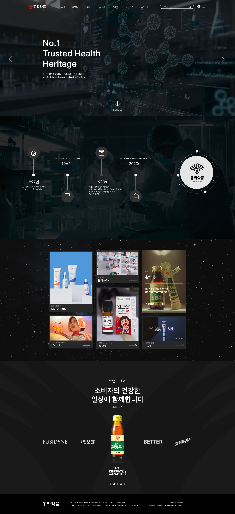
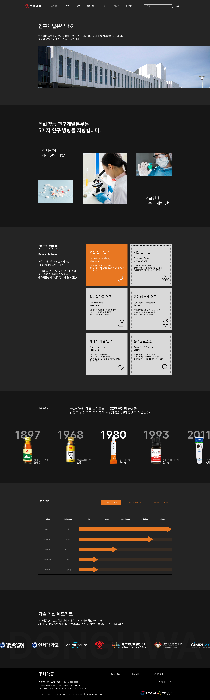

# 동화약품 리뉴얼 프로젝트

동화약품 웹사이트 리뉴얼은 기획 → 디자인 → 구현 단계로 진행했습니다. 
<h4>기획</h4> : 브랜드 히스토리와 주요 제품, R&D 방향을 분석해 정보 구조와 콘셉트를 재정리했습니다. 
<h4>디자인</h4> : Photoshop과 Figma로 메인·서브 페이지 UI와 비주얼을 설계했습니다. 
<h4>구현</h4> : HTML, CSS, JavaScript를 활용해 구조를 코딩하고, 다양한 해상도에서 자연스럽게 동작하도록 반응형 웹사이트로 제작했습니다.

[동화약품 리뉴얼](https://hanav52.github.io/WebDeisgn/public/mainindex.html)

<h2>Project Date</h2>
2025. 12 ~ 2025. 12 
  
<h2>환경 & 기술</h2>

> JavaScript ES6 사용
> 
> HTML5, CSS3, Swiper.js를 사용하여 반응형 사이트 구조 및 css 작업
>
> Figma, Photoshop 등을 사용하여 디자인 초안 구현
>
> Git을 이용하여 배포

## 기획
<h5>기획서</h5>

## 디자인(Figma)

[Figma 디자인](https://www.figma.com/design/t3feGkoX4VFdZrqoZ2qVHI/%EC%9B%B9%EC%82%AC%EC%9D%B4%ED%8A%B8%EB%94%94%EC%9E%90%EC%9D%B8?node-id=0-1&t=bGeflFnOkYMXDmY3-1)
<h5>와이어프레임</h5>

  <h5>MainPage</h5>

  <h5>SubPage</h5>

## 화면(반응형)

[동화약품 리뉴얼](https://hanav52.github.io/WebDeisgn/public/mainindex.html).

